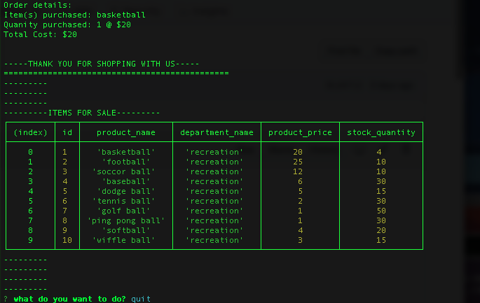

# Bamazon-node-app

Bamazon-node-app is Amazon-like app, created with JavaScript, Node.js and MySQL database. The application has 3 modes: Customer mode, Manager mode and Supervisor mode.

**Customer Mode**

When you run bamazonCustomer.js file, as a customer, you will be prompted if you want to buy a product. If you do, you will see a table with:

 * a list of products, 
 * products id, 
 * products prices, 
 * quantity, 
 * Departments names,
 * Departments ID

 After that, user will be asked for two questions: 

 * ID of a product, that user wants to buy 
 * How many products user wants to buy

 If user will input more quantity than store has, user will get a message "Insufficient quantity".
 If user input correct numbers, the purchase will be proceed and quantity will be updated.

 **Manager Mode**

When you run bamazonManager.js file, as a manager, you will be prompted following options:

* `View Products for Sale`,
* `View Low Inventory`,
* `Add to Inventory`,
* `Add New Product`

1. `View Products for Sale` feature will create a table with following data: 
    * Item ID
    * Product name
    * Price
    * Stock Quantity
    * Product Sales
    * Department ID

2. `View Low Inventory` feature will create a table with data about products with quantity less than 5
3. `Add to Inventory` feature will promt user for Product ID and how many products user wants to add. After that quantity of this product will be updated in database.
4. `Add New Product` feature will prompt user for a few questions about new product, such as name, price, quantity and department ID. User will see the results by using `View Products for Sale` feature.

**Supervisor Mode**

When you run bamazonSupervisor.js file, as a supervisor, you will be prompted following options:

`View Products Sales by Department`
`Create a New Department`

1. `View Products Sales by Department` feature will create a table with following data: 

    * Department ID
    * Department name
    * over_head_cost (How much money were spent for products of each department)
    * Total Profit (product_sales - over_head_cost). If number is more than 0, it means that this department makes profit, If less than 0 - not yet.
    * Product Sales

2. `Create a new department` feature will prompt user for two questions about new department, such as name and over_head_cost.

All three Modes have shared database. It means that if customer will buy some product, it will update a few columns:

* Product quantity in customer and manager modes
* Product sales in manager and supervisor modes
* Total profit in supervisor mode
